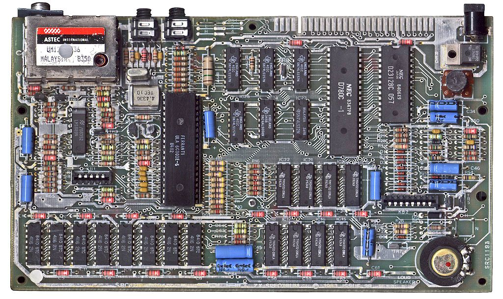
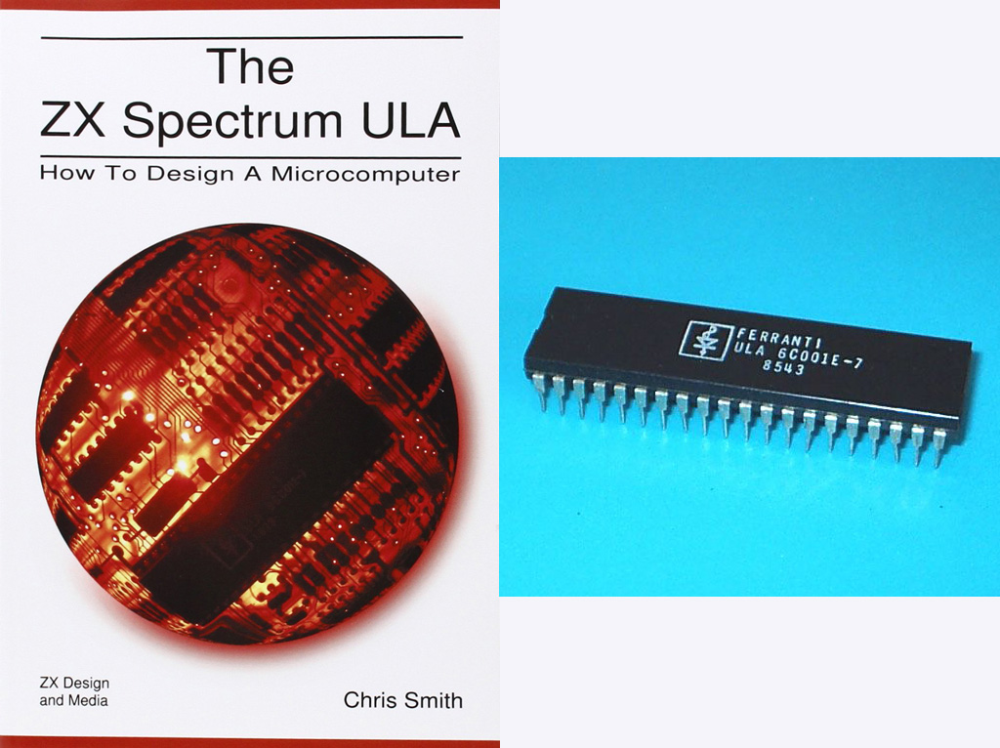

# ZX-Spectrum-Adventure-2020
Retro Computing: Rebuilding my first home computer some 30 years later (ULA free)

## This project

The Sinclair ZX Spectrum 48K was my first home computer back in the 1980s. It was Z80 CPU-based and I just loved it and learned a lot from it.  
In spring 2020 I learned by chance about Chris Smith genius book [The ZX Spectrum ULA: How to Design a Microcomputer](https://www.amazon.com/Christopher-David-Smith/dp/0956507107), acquired and read it. 
In it he describes his reverse engineering of this *mysterious* ULA (Uncommitted Logic Array) chip and explains in great detail all of its functions.  
Chris also developed the Harlequin, a ZX Spectrum 48K clone based on parts that replace the ULA, so this chip is not needed anymore. 
Complete in 2008, it is the first 100% timing compatible clone. 
ZX Spectrum fans continued on this development which resulted in the design that is now known as the ‘Harlequin Superfo’. The current Rev G is the most stable one.  
When I read all about this, I could not resist and decided in July 2020 to rebuild the ZX Spectrum, just for the fun of it. 
This will be a low priority project of mine, I plan to have it working maybe in a couple of months. 

## Images

###### The original ZX Spectrum mainboard

###### Chris Smith book and the ULA chip, the main object of his analysis

## Project log

- 2020/07 decided to rebuild the ZX Spectrum, based on the Harlequin Superfo board Rev G
- 2020/07 ordered a ZX Spectrum replacement case, keyboard and keyboard mat
- 2020/07 ordered the Harlequin PCB Rev G
- 2020/09 ordered a EPROM USB Universal Programmer TL866II Plus

## Links

| Topic / Links | Comments |
|---|---|
| **ZX Spectrum Resources** ||
| [Spectrum for Everyone](https://spectrumforeveryone.com) | Solid archive of information, reviews, articles and links for the Sinclair ZX Spectrum |
| [Sinclair FAQ Wiki](https://faqwiki.zxnet.co.uk/wiki/Main_Page) | Many technical information and resources |
| [8-Bit Wiki](http://www.8bit-wiki.de/8bitdb.html?&no_cache=1&tx_coolautoindex_pi1=1e127fc000000dir.Sinclair%2FZX_Spectrum%2F) | Technical resources and documents |
| [ZX Spectrum ROM images](https://faqwiki.zxnet.co.uk/wiki/ROM_images) | ROM images for ZX Spectrum, clones/derivatives and peripherals |
| [ZX Spectrum Diagnostics](https://github.com/brendanalford/zx-diagnostics/wiki) | ZX Spectrum Diagnostics ROM & Hardware |
| **ZX Spectrum Forums** ||
| [Sinclair ZX World](https://www.sinclairzxworld.com) | -- |
| [tlienhard/Spectrum](https://forum.tlienhard.com/phpBB3/viewforum.php?f=6) | -- |
| **Harlequin Superfo Development** ||
| [ZX Design Info](http://www.zxdesign.info/harlequin.shtml) | Chris Smith site, Harlequin creator and developer |
| [Superfo Harlequin ZX Spectrum clone](http://trastero.speccy.org/cosas/JL/Harlequin/superfo1.html) | José Leandro Martínez site, developed the Harlequin further |
| [Harlequin-ZX Spectrum48-Nachbau](https://forum.tlienhard.com/phpBB3/viewtopic.php?f=6&t=981) | Building Rev F (Ingo Truppel) [(Archived)](Archive/Harlequin_ZX_Spectrum48_Nachbau.pdf) |
| **Harlequin Superfo Build Blogs** ||
| [The Harlequin 48k: A Spectrum Clone for the DIY-User](http://retrodepot.net/?p=3010) | Doug Gabbard's Blog [(Archived)](Archive/The_Harlequin_48k_A_Spectrum_Clone_for_the_DIY-User.pdf) |
| [Building ZX Spectrum Clone - Harlequin](http://www.malinov.com/Home/sergey-s-blog/buildingzxspectrumclone-harlequin-part1) | Sergey Kiselev's Blog [(Archived)](Archive/Building_ZX_Spectrum_Clone_Harlequin.pdf) |
| [Building a Harlequin ZX Spectrum Clone](http://blog.tynemouthsoftware.co.uk/2016/11/building-harlequin-zx-spectrum-clone.html) | Dave Curran's Blog [(Archived)](Archive/Building_a_Harlequin_ZX_Spectrum_Clone.pdf) |
| [Building a Harlequin Spectrum 128K Clone](http://www.breakintoprogram.co.uk/projects/harlequin/building-a-harlequin-spectrum-128k-clone) | Dean Belfield's Blog [(Archived)](Archive/Building_a_Harlequin_Spectrum_128K_Clone.pdf) |
| [ZX Spectrum Harlequin](https://blog.gjmccarthy.co.uk/zx-spectrum-harlequin/) | Greg's Blog |
| **Keyboard** ||
| [48K-KDLX - ZX Spectrum 48k keyboard w. smd tactile switches](https://www.sinclairzxworld.com/viewtopic.php?f=21&t=1488) | [(Archived)](Archive/48K-KDLX-ZX_Spectrum_48k_keyboard_w._smd_tactile_switches.pdf) |
| [ZX Spectrum Keyboard mit SMD Tastern](https://forum.tlienhard.com/phpBB3/viewtopic.php?f=6&t=1265) | [(Archived)](Archive/ZX_Spectrum_Keyboard_mit_SMD_Tastern.pdf) |
| **Interfaces** ||
| [8bit-wiki/Interfaces](http://www.8bit-wiki.de/8bitdb.html?&no_cache=1&tx_coolautoindex_pi1=cd5c2c1000000dir.Sinclair%2FZX_Spectrum%2Finterfaces%2F) | misc. Interface resources, schematics, firmwares |
| [Interface 1bis](https://sites.google.com/site/interface1bis/home) | |
| [ProjectsSPECCY](http://projectspeccy.com/projects/) | Re-Creation of some historical interfaces, Romantic Robot Multiface 128, and others |
| **Other Clones** ||
| [List of ZX Spectrum clones](https://en.wikipedia.org/wiki/List_of_ZX_Spectrum_clones) | -- |
| [Nice overview of ZX Spectrum clones](http://tarjan.uw.hu/zxclones_en.htm) | [(Archived)](Archive/ZX_Spectrum_in_the_21st_Century.pdf) |
| [ZX-Nachbau Spectral (Neuauflage)](https://www.sax.de/~zander/zx/spec_nb.html#LIT) | Spectral - another ZX Spectrum clone [(Archived)](Archive/ZX-Nachbau_Spectral_(Neuauflage).pdf) |
| [Sizif-512](https://github.com/UzixLS/zx-sizif-512) | Another CPLD-based ZX Spectrum clone for 48K rubber case with some sweet features by UzixLS |
| [STECCY](https://www.mikrocontroller.net/articles/STECCY) | ZX-Spectrum-Emulator mit STM32 on a STM32F407VET Black Board and ILI9341 or SSD1963 LCD |
| [STECCY Forum Thread](https://www.mikrocontroller.net/topic/490145#new) | -- |
| **Shops** ||
| [ZX Renew](https://zxrenew.co.uk) | -- |
| [ByteDelight](https://www.bytedelight.com) | -- |
| [Sintech](https://www.sintech-shop.de/retro-atari-commodore-sinclair-etc/sinclair/spectrum) | -- |
| [DivIDE](http://divide.cz/?x=eshopn&lang=en) | -- |
|  | |

## Lizenz

**Creative Commons BY-NC-SA** 
Give Credit, NonCommercial, ShareAlike

 This work is licensed under a <a rel="license" href="http://creativecommons.org/licenses/by-nc-sa/4.0/">Creative Commons Attribution-NonCommercial-ShareAlike 4.0 International License</a>.
